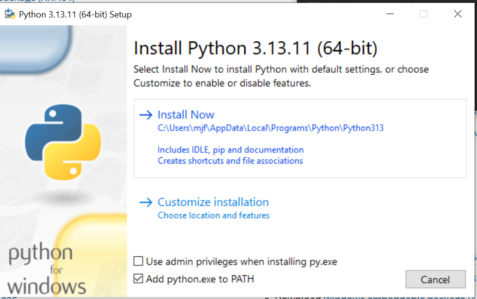
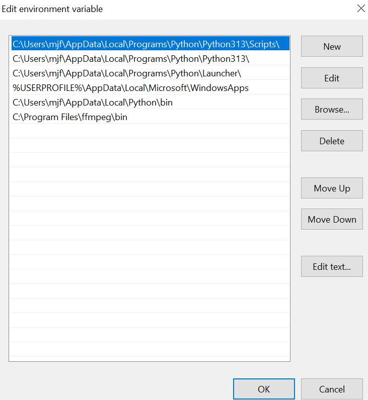

# subtitle-podcast.ps1

This script takes an audio file as input and generates a subtitle track,
a static image, and combines them to create a subtitled video of the
audio. I originally made this to transcribe recorded tabletop games for
a friend to allow for easy re-reading.

Transcription relies entirely on the WhisperX project which uses an
Automatic Speech Regonition (ASR) model original developed by OpenAI. If
you like this script, please consider supporting the WhisperX project
with a donation!

https://github.com/m-bain/whisperX

## Requirements
- Powershell
- Python 3.9 to 3.13
- ffmpeg
- About 5-10 GB of free space for AI models

## Setup

### Install Powershell

Highly suggest downloading the latest Powershell version from github:

https://github.com/PowerShell/PowerShell/releases

The latest version as of now:

https://github.com/PowerShell/PowerShell/releases/download/v7.5.4/PowerShell-7.5.4-win-x64.msi

### Install Python and pip

At the time of writing (Jan 2026) WhisperX seems to only work with
python 3.13 and lower. The latest version of Python may or may not work

https://www.python.org/ftp/python/3.13.11/python-3.13.11-amd64.exe

Be sure to check "Add to Path" during installation



### Install Whisperx


If you used the link above, you should be able to run this on Powershell

```pwsh
pip.exe install whisperx
```

### Install ffmpeg

1. Download the latest build [here](https://github.com/BtbN/FFmpeg-Builds/releases/download/latest/ffmpeg-master-latest-win64-gpl-shared.zip)

2. Unzip the folder and rename it to "ffmpeg" to keep it simple.

3. Move the unzipped ffmpeg folder to a place you'll remember. `C:\Program Files\`
   is usually a good bet

4. Add the path to the ffmpeg "bin" folder to your Path. If you are not familiar with environment variables, you may want to read [this guide](https://www.architectryan.com/2018/03/17/add-to-the-path-on-windows-10/) first
    * Search "Path" in the search bar and find the "Environment
    variables..." button
    * In the new window, double click the item in the list that's
    titled "PATH"
    * Click "New" and copy the location of the "bin" folder

If you have it right, your path should look something like this with a different username of course:



Once confirmed, click "OK" on all the windows.

### Allow execution

If your Powershell disables execution by default

```pwsh
Unblock-File subtitle-podcast.ps1
```

## Usage

Move the script into the directory you have your audio files. Open up
Powershell in that location (right click > Open in Powershell)

```pwsh
.\subtitle-podcast.ps1 episode01.mp3
```

Place cover files in the same directory as your mp3, with a name like "episode01.jpg"


For example, if your files are in a folder called "pods"

```
pods\
---- episode01.mp3
---- episode01.jpg
---- subtitle-podcast.ps1
```

Only ".png" and ".jpg" extentions are allowed since I'm lazy.

### Sample output

https://github.com/user-attachments/assets/c9a8b408-b48b-464a-b386-1eed8a5184c2

## Hacking

### Video format

This script produces and mp4 file by default since it is decent for web embedding. If you want a different video output, just change line 45

```pwsh
$OutputVideo = "$Title.mp4"
```

### Accuracy

WhisperX is still fairly new and actively developed, so do not expect
perfect transcription results. For example, you may find a number of
proper names don't get transcribed well. Grunts, laughter, and other
non-distinct may also produce unexpected results.

To make this as simple as possible without using any custom models, this
script uses the large English model provided by WhisperX.

But there are many other models the tool supports, most notably,
other languages. For the most details on this, see the WhipserX github
and make edits accordingly

https://github.com/m-bain/whisperX?tab=readme-ov-file#other-languages

A potential hack for missing names would be to bias the prompt of
whisperx with known names that appear in the audio. If you want to
experiment with this you can add the following line after line 38 (be
sure to include the backtick ` at the end)

```pwsh
--initial_prompt "Names in this broadcast include: Mike Fernèz, Mr. McGuire" `
```
